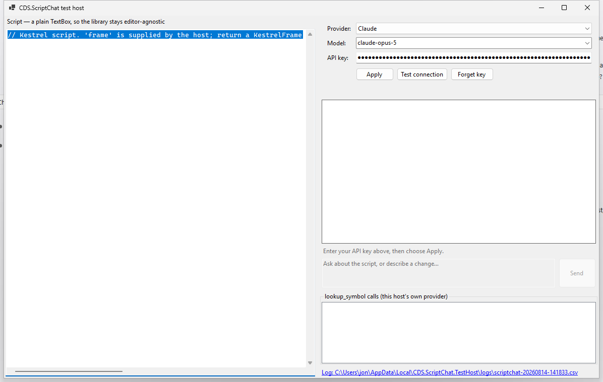

# CDS.ScriptChat

[](https://github.com/nooogle/CDS.ScriptChat.WinForms/actions/workflows/ci.yml)
[](https://github.com/nooogle/CDS.ScriptChat.WinForms/actions/workflows/codeql.yml)
[](https://securityscorecards.dev/viewer/?uri=github.com/nooogle/CDS.ScriptChat.WinForms)
[](https://www.nuget.org/packages/CDS.ScriptChat.WinForms)
[](https://www.nuget.org/packages/CDS.ScriptChat.Core)
[](LICENSE)
[](https://dotnet.microsoft.com/)

A drop-in **script + chat panel** for .NET/WinForms apps that let a user edit a
script: the user talks to an LLM about the script open in their editor, and
the assistant can propose edits to it. Edits always arrive as a reviewable
diff — never applied automatically.

Not tied to any particular scripting engine, editor control, or AI provider.
The library reaches your script through two delegates you supply and your API
key through a settings panel you wire up, so it works with Scintilla, a plain
`TextBox`, or anything else — and with Claude or OpenAI today, more providers
later.



*The bundled test host — a minimal reference app showing the panel wired up
end to end. Every consuming app wires the same two pieces shown on screen:
`ScriptChatSettingsPanel` (top right) for BYOK onboarding, and
`ScriptChatPanel` (below it) for the conversation itself.*

## Why

Several in-house apps (Fable, the OpenCvSharp Playground, and eventually a
GroundTruth scripting surface) each have a scripting surface where "let the
user ask an AI about this script" is a recurring want. Rather than build that
once per app, `CDS.ScriptChat` builds it once, host-agnostically, and each app
supplies only what's specific to it: how to read/write its script buffer, and
how to answer "what does this symbol look like" against its own API surface.

## What it can do

- **Ask questions** about the script open in the editor, with no code change
  implied — a plain text answer.
- **Propose an edit** — shown inline as a diff, applied only when the user
  clicks Accept. Never parsed out of a markdown code fence, never applied
  silently.
- **Look up a real symbol** from your app's own API while reasoning about the
  script (`lookup_symbol`), so suggestions use APIs and signatures that
  actually exist instead of the model's best guess.
- **Carry a multi-turn conversation**, where each accepted edit becomes the
  baseline for the next turn, and a rejected edit doesn't quietly poison the
  model's memory of what the script currently looks like.
- **Onboard a user's own API key** (BYOK) — provider/model choice, key entry,
  a "test connection" button, and per-user storage via Windows DPAPI.

## Packages

This repository ships two NuGet packages, split so nothing AI/provider-related
ever leans on WinForms:

| Package | What it is |
|---|---|
| [`CDS.ScriptChat.Core`](src/CDS.ScriptChat.Core/readme.md) | The provider-agnostic conversation engine. Built on `Microsoft.Extensions.AI.IChatClient`; no WinForms, no Roslyn. |
| [`CDS.ScriptChat.WinForms`](src/CDS.ScriptChat.WinForms/readme.md) | The ready-made WinForms UI: chat panel, settings panel, DPAPI key store. |

Each package's own readme (linked above) is what nuget.org shows — kept short
and focused on that one package. This document is the wider picture: what the
library is for, how the pieces fit together, and how to get started from a
clean checkout.

## Quick start

Add the panel to a form in the WinForms Designer (it's a standard
`UserControl`, so it drops in and resizes like any other), then wire it up in
code:

```csharp
// 1. Give the panel a way to read and write your script. This is the whole
//    editor contract — there's no interface to implement.
_chatPanel.ScriptTextProvider = () => _scriptTextBox.Text;
_chatPanel.ScriptTextSetter = script => _scriptTextBox.Text = script;

// 2. Configure it with a provider, model, and the user's own API key.
_chatPanel.Configure(new ScriptChatClientOptions
{
    Provider = ScriptChatProvider.Claude,
    ApiKey = apiKey,          // BYOK — never logged, cached, or stored by this library
    ModelId = "claude-opus-5",
});
```

That's enough for questions and diff-reviewed edits to work. For the BYOK
onboarding flow shown in the screenshot above — provider/model dropdowns, key
entry, a test-connection button, and persistence between runs — drop a
`ScriptChatSettingsPanel` alongside it and feed its `ConfigurationApplied`
event into `Configure`:

```csharp
_settingsPanel.KeyStore = DpapiApiKeyStore.ForApplication(appName, logger);
_settingsPanel.ConfigurationApplied += (_, e) => _chatPanel.Configure(e.ClientOptions);
```

To let the assistant answer questions about your own API accurately, implement
`ISymbolLookupProvider` and pass it in via `ScriptChatSessionOptions` — a
single `LookupAsync(symbolName, containingType)` method, answered however
suits your app (Roslyn, reflection, a hand-written table, a remote service).
Skip it and the library falls back to a no-op provider so everything else
still works.

The full worked example — including a concrete `ISymbolLookupProvider` and a
`scriptchat.context.md` orientation file — is in
[`samples/CDS.ScriptChat.TestHost`](samples/CDS.ScriptChat.TestHost/); it's
the fastest way to see every wiring point in one place.

## How it works

```
┌─────────────────────────┐
│  Your host app           │  supplies: script get/set delegates,
│  (Fable, Playground, …)  │  ISymbolLookupProvider, orientation blurb
└────────────┬─────────────┘
             │
┌────────────▼─────────────┐
│  CDS.ScriptChat.WinForms  │  ScriptChatPanel (transcript, diff/accept UI)
│                           │  ScriptChatSettingsPanel (BYOK onboarding)
│                           │  DpapiApiKeyStore
└────────────┬─────────────┘
             │
┌────────────▼─────────────┐
│  CDS.ScriptChat.Core      │  ScriptChatSession (conversation, tool calls)
│                           │  ScriptChatClientFactory (Claude / OpenAI)
│                           │  built on Microsoft.Extensions.AI.IChatClient
└───────────────────────────┘
```

A few decisions worth knowing before you integrate:

- **Edits are structured, not scraped.** Proposed code arrives via a
  `propose_script_edit` tool call, rendered as a diff. The library never
  parses code out of the model's free-text response, and never touches your
  editor buffer until the user clicks Accept.
- **Nothing use-case-specific ships in the library.** No Roslyn, no
  Scintilla, no particular scripting engine — the script buffer is two
  delegates, and API knowledge is an interface you implement.
- **Switching provider or model resets the conversation.** There's no
  cross-provider history carryover — each configuration change starts a
  fresh session.
- **No prompt, script, response, or key is ever logged, cached, or sent
  anywhere except the direct provider SDK call.** This isn't an opt-in default
  — the capability doesn't exist anywhere in the library, including inside
  its own dependencies (see the design doc's D17 for how that's enforced).

For the full architecture, the decision log behind choices like these, and
current milestone status, see
[`cds.scriptchat.design.md`](cds.scriptchat.design.md) — it's the living
design record for this project and the best next read after this file.

## Status

Milestones 1 and 2 are complete: single- and multi-turn conversations, Q&A,
symbol lookup, diff/accept edits, and BYOK onboarding all work end to end
against both Claude and OpenAI. Grok, mid-session provider switching,
streaming responses, and multi-script hosts are deliberately deferred — see
"Future milestones" in the design doc.

## Building from source

```
dotnet build CDS.ScriptChat.WinForms.slnx
```

Tests use the modern MSTest runner (Microsoft.Testing.Platform), so run them
as executables rather than via `dotnet test`:

```
dotnet run --project tests/CDS.ScriptChat.Core.Tests
dotnet run --project tests/CDS.ScriptChat.WinForms.Tests
```

To try the panel from another app on this machine before it's on NuGet.org,
`pack-local.ps1` packs both projects to a local feed — see
[`todo.packaging.md`](todo.packaging.md) for the current packaging and release
status.

## License

MIT — see [LICENSE](LICENSE).

Package icon: [Seo and web icons created by Yogi Aprelliyanto — Flaticon](https://www.flaticon.com/free-icons/seo-and-web)
